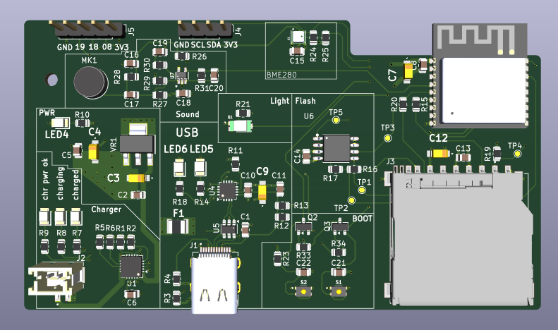
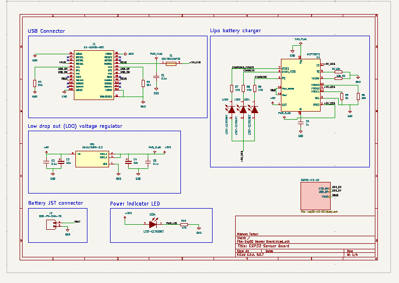
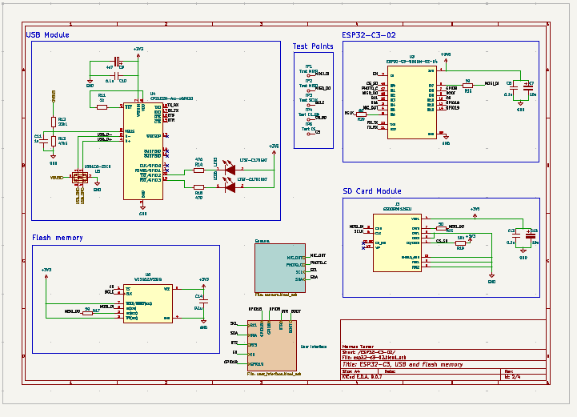
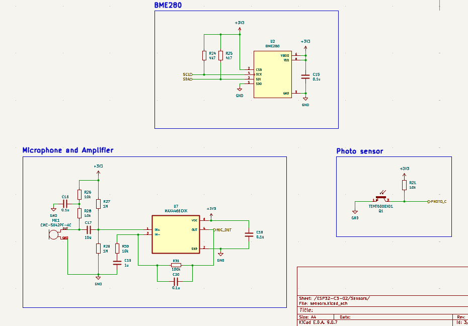
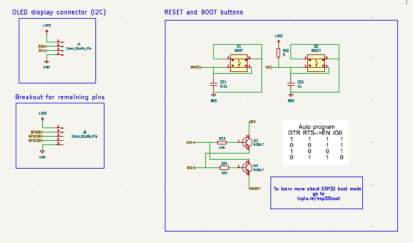
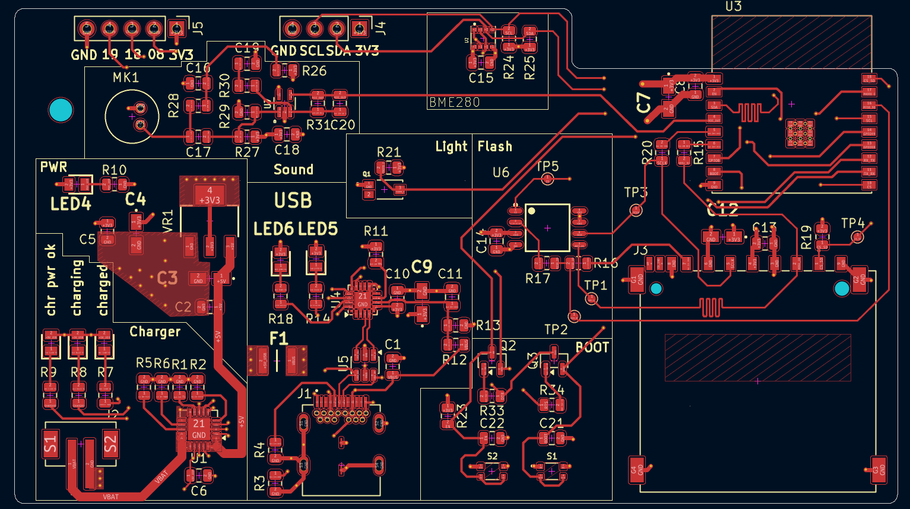
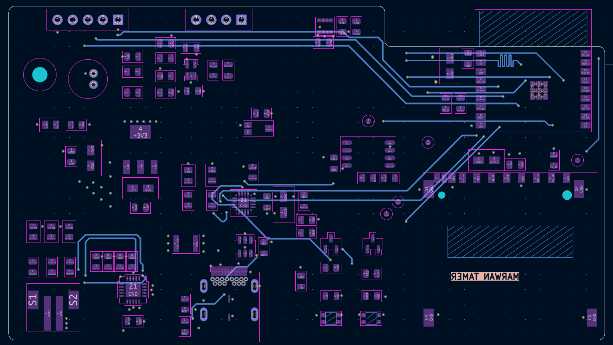
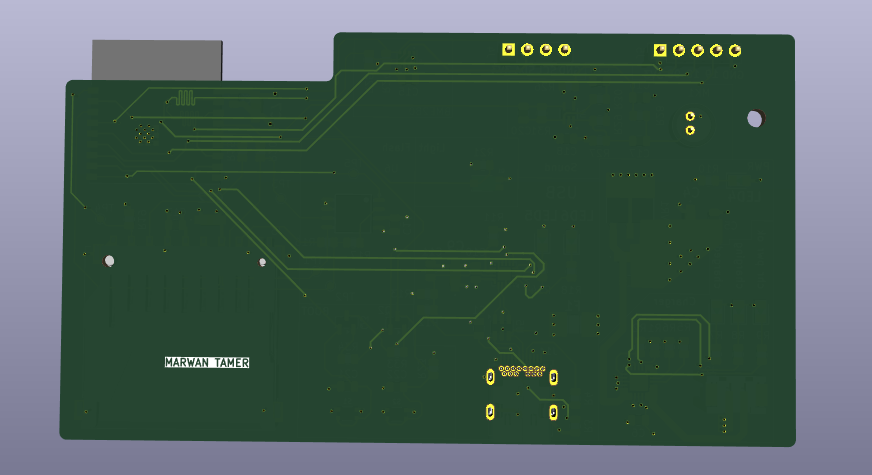

# ESP32 Sensor Board

A 4-layer ESP32-C3 IoT sensor board with onboard LiPo charging, SD storage, and a multi-sensor front end, designed in KiCad by following Tech Explorations' full board-development pipeline tutorial — my most advanced build yet, covering the complete flow from schematic to manufacturing and assembly.



## Overview

This board is built around the **ESP32-C3-WROOM-02**, a RISC-V Wi-Fi/BLE module, paired with a small sensor suite (environmental, audio, and light), onboard SPI flash, microSD storage, and a full LiPo battery charging path — a compact, self-contained IoT sensor node platform.

| | |
|---|---|
| **MCU** | ESP32-C3-WROOM-02 (RISC-V, Wi-Fi + BLE) |
| **Sensors** | BME280 (temperature/humidity/pressure), electret mic + MAX4466 amplifier, TEMT6000 ambient light sensor |
| **Storage** | W25Q32JVSSIQ SPI flash (32 Mbit) + microSD card slot |
| **Connectivity** | USB-C (via CP2102N USB-UART bridge), I2C header for OLED display, GPIO breakout |
| **Power** | USB-C (5V) or LiPo battery (JST connector), MCP73871 Li-ion/LiPo charge management, LM1117MPX-3.3 LDO |
| **Programming** | Auto-program circuit (DTR/RTS → EN/IO0 via BC817 transistors) — no manual boot/reset sequence needed |
| **PCB** | 4-layer |
| **Design Tool** | KiCad 9 |

## What I Learned

This project pushed further than my previous boards, moving from single-sheet schematics and simple 2-layer boards into a full multilayer design with manufacturing and assembly considerations built in from the start:

**Schematic Design**
- Multi-sheet hierarchical schematic structure, splitting the design into logical sub-sheets (USB/flash, sensors, user interface, power)
- Creating a custom KiCad component library for parts not available in the standard libraries, registered globally for reuse in future projects
- Designing a complete LiPo charging path around the MCP73871, including charge-status indication (charging/charged LEDs) and battery sense/thermistor handling

**PCB Layout**
- Working with a 4-layer stack-up and signal tuning across layers
- Zone fills across both available and non-available power planes, and understanding how that affects plane continuity and return paths
- Component placement and routing for mixed digital, analog (microphone/amp), and RF (Wi-Fi/BLE) sections on the same board

**Manufacturing & Assembly**
- Design for Manufacturability (DFM) checks using HQDFM (NextPCB)
- Generating centroid (pick-and-place) files for PCB assembly
- Thinking through the board as something meant to be assembled by a fab, not just etched and hand-soldered

## Gallery

| Schematic (Power & USB) | Schematic (ESP32, USB, Flash) |
|---|---|
|  |  |

| Schematic (Sensors) | Schematic (User Interface) |
|---|---|
|  |  |

| PCB Top | PCB Bottom |
|---|---|
|  |  |

| 3D Front | 3D Back |
|---|---|
|  |  |

## Repository Structure

```
ESP32-Sensor-Board/
├── README.md
├── Hardware/                        # Manufacturing-ready outputs
│   ├── ESP32 Sensor Board_Schematic.pdf
│   ├── ESP32 Sensor Board_PCB.pdf
│   ├── BOM.csv
│   └── Gerbers.zip
├── Images/                          # Renders and layer screenshots
│   ├── 3D_Back.png
│   ├── 3D_Front.png
│   ├── PCB_Bottom.png
│   ├── PCB_Top.png
│   ├── Schematic_Page_1.png
│   ├── Schematic_Page_2.png
│   ├── Schematic_Page_3.png
│   └── Schematic_Page_4.png
└── Source Files/                    # Full KiCad project (editable source)
    ├── Additional Components/       # Custom library (parts, footprints)
    ├── Esp32 Sensor Board.kicad_pcb
    ├── Esp32 Sensor Board.kicad_prl
    ├── Esp32 Sensor Board.kicad_pro
    ├── Esp32 Sensor Board.kicad_sch
    ├── esp32-c3-02.kicad_sch
    ├── sensors.kicad_sch
    ├── user_interface.kicad_sch
    └── fp-lib-table
```

## Credit

Built by following [Tech Explorations](https://www.linkedin.com/company/techexplorations/)'s ESP32 sensor board tutorial, which covers the complete pipeline from board specification through ordering and assembly. This project is a learning exercise, not an original design — full credit for the schematic architecture and design decisions goes to Tech Explorations' tutorial series.

## Author

**Marwan Tamer**
Electrical Power Engineering student, building toward Embedded Systems Engineering
[LinkedIn](https://www.linkedin.com/in/-marwan-tamer)
